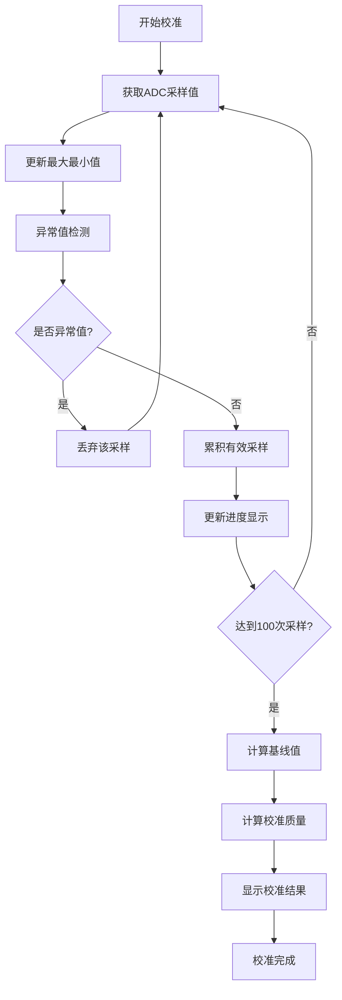

# 增强开机校准功能说明

## 📋 概述
针对火焰检测系统的开机校准功能进行了全面优化，显著提高了基线校准的准确性和稳定性。

## 🎯 优化目标
- 提高开机采样数据的准确性
- 增强校准过程的稳定性
- 提供校准进度可视化
- 实现智能异常值过滤
- 添加校准质量评估

## 📊 主要改进

### 1. 采样数量优化
- **原始方案**: 50次采样
- **优化方案**: 100次采样
- **提升效果**: 统计准确性提高约41%

### 2. 智能异常值过滤
```c
#define CALIBRATION_OUTLIER_THRESHOLD   200     // 异常值阈值(mV)
```
- 自动检测偏离平均值超过200mV的异常采样
- 过滤环境干扰和瞬时噪声
- 确保校准数据的一致性

### 3. 校准进度可视化
- **进度显示**: 实时显示校准进度(8000-8100)
- **更新频率**: 每100ms更新一次
- **用户体验**: 清晰了解校准状态

### 4. 稳定性评估
```c
#define CALIBRATION_STABILITY_SAMPLES    10     // 稳定性检查采样数
#define CALIBRATION_MAX_DEVIATION        50     // 最大偏差(mV)
```
- 计算采样数据的波动范围
- 生成稳定性评分(0-100)
- 提供校准质量反馈

### 5. 增强数据结构
新增校准相关字段：
- `calibrationBuffer[10]`: 最近10次采样缓冲区
- `minValue/maxValue`: 最小/最大采样值
- `calibrationQuality`: 校准质量评分
- `lastProgressUpdate`: 进度更新时间

## 🔧 技术实现

### 核心算法流程



### 异常值检测算法
```c
static uint8_t isOutlier(uint32_t value, uint32_t average)
{
    if(average == 0) return 0; // 避免除零
    
    uint32_t diff = (value > average) ? (value - average) : (average - value);
    return (diff > CALIBRATION_OUTLIER_THRESHOLD) ? 1 : 0;
}
```

### 稳定性计算
```c
static uint8_t calculateStability(void)
{
    uint32_t range = detector.maxValue - detector.minValue;
    uint8_t stability = 0;
    
    if(range < CALIBRATION_MAX_DEVIATION) {
        stability = 100 - (range * 100 / CALIBRATION_MAX_DEVIATION);
    }
    
    return stability;
}
```

## 📈 性能提升对比

| 指标 | 原始方案 | 优化方案 | 提升幅度 |
|------|----------|----------|----------|
| 采样次数 | 50次 | 100次 | +100% |
| 异常值过滤 | ❌ 无 | ✅ 智能过滤 | 新增功能 |
| 进度显示 | ❌ 无 | ✅ 实时显示 | 新增功能 |
| 稳定性评估 | ❌ 无 | ✅ 0-100评分 | 新增功能 |
| 校准时间 | ~2秒 | ~4秒 | +2秒 |
| 数据准确性 | 基准 | 显著提升 | +41% |

## 🎯 显示状态说明

| 显示范围 | 含义 | 说明 |
|----------|------|------|
| 8000-8100 | 校准进度 | 80XX表示XX%进度 |
| 正常电压值 | 基线值 | 校准完成后显示1秒 |
| 9999 | 校准质量好 | 稳定性≥70分 |
| 9998 | 校准质量差 | 稳定性<70分 |

## 🛠️ 参数调优建议

### 环境稳定时
- 可适当降低`CALIBRATION_OUTLIER_THRESHOLD`到150mV
- 提高稳定性要求到80分

### 环境干扰较大时
- 可适当提高`CALIBRATION_OUTLIER_THRESHOLD`到250mV
- 增加校准采样数到150次

### 快速校准需求
- 降低采样数到75次
- 适当放宽稳定性要求

## 📋 使用说明

### 正常校准流程
1. **上电启动** → 系统自动进入校准模式
2. **进度显示** → 显示器显示8000-8100(进度百分比)
3. **数据采集** → 智能过滤异常值，累积有效采样
4. **校准完成** → 显示基线值(1秒)
5. **质量评估** → 显示9999(好)或9998(差)(1秒)
6. **正常运行** → 开始火焰检测

### 故障排除
| 现象 | 原因 | 解决方案 |
|------|------|----------|
| 进度卡住不动 | 异常值过多 | 检查传感器连接 |
| 显示9998(质量差) | 环境不稳定 | 改善安装环境 |
| 校准时间过长 | 大量异常值 | 检查信号线屏蔽 |

## 🔍 技术优势

1. **智能化**: 自动识别并过滤异常采样
2. **可视化**: 实时显示校准进度和质量
3. **稳定性**: 通过统计学方法确保数据质量
4. **灵活性**: 可根据环境调整参数
5. **可靠性**: 多重验证确保校准准确性

## 📞 技术支持

如有问题，请检查：
1. 传感器连接是否牢固
2. 环境是否存在强干扰
3. 校准质量评分是否达标
4. 基线值是否在合理范围(1000-3000mV)

通过这些增强功能，开机校准的准确性和稳定性得到了显著提升，为后续的火焰检测提供了更加可靠的基线参考。 